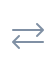

<h1 align="center">Stash Metadata</h1>

<p align="center">
  <a href="https://stashapp.cc"></a>
  &nbsp;&nbsp;
  
  &nbsp;&nbsp;
  <a href="https://github.com/Silo-Server/silo-server"></a>
</p>

<p align="center"><strong>Stash ↔ Silo</strong><br>Metadata, artwork, playback and Watchlist sync.</p>

<p align="center">
  <a href="https://github.com/Net005/JAVBeacon"></a><br>
  <a href="https://github.com/Net005/JAVBeacon"><strong>JAVBeacon</strong></a> · Optional integration<br>
  <sub>Connect for extra artwork, cached enrichment and release collections.</sub>
</p>

<p align="center">
  <a href="https://github.com/Net005/silo-plugin-metadata-stash/releases/latest">Download</a> ·
  <a href="#quick-start">Quick start</a> ·
  <a href="#features">Features</a> ·
  <a href="contrib/tampermonkey/README.md">Browser script</a> ·
  <a href="https://github.com/Net005/JAVBeacon">JAVBeacon</a> ·
  <a href="https://github.com/Net005/silo-plugin-metadata-stash/issues">Support</a>
</p>

## Features

| Feature | What you get |
| --- | --- |
| **Metadata & people** | Stash scene metadata, artwork and linked performer profiles in Silo. Exact matching skips ambiguous results. |
| **Playback sync** | Completed Silo plays and resume checkpoints sent to Stash, with duplicate protection. A separate worker imports Stash watched state into matched local Silo items. |
| **Watchlist sync** | Stash tag changes and Silo Watchlist actions update the selected saved-filter collections. Re-adding an item moves it to the top. Changes queue for background sync and retry after failures. |
| **Saved-filter collections** | Selected Stash scene filters become Silo collections, with optional JAVBeacon release filters and rotating member artwork. |
| **Artwork storage** | Cache selected posters and backdrops in Silo's local or S3 storage. Optional JAVBeacon adds conformed covers and cached screenshots. |
| **Recommendations** | Weekly collections, feedback, preview reports, retained report history and spending controls. [Guide →](RECOMMENDATIONS.md) |
| **Stash companion** | Watchlist controls, subtitle requests, cover previews, large seek previews, targeted Silo refresh and fill-only metadata migration. |
| **Silo browser script** | Backdrop previews, compact ratings, O-count controls, person O-count badges, **+ Sub**, **Open in Stash**, full release dates and clickable genre/studio filters. [Guide →](contrib/tampermonkey/README.md) |

## What to install

| Component | Runs in | Use it for |
| --- | --- | --- |
| **Stash Metadata** | Silo | Metadata, image resolution, playback sync and collection workers. |
| **Stash.Silo Companion** | Stash | Stash UI controls, incoming Watchlist changes, subtitle jobs and targeted refresh. |
| **Tampermonkey userscript** · optional | Your browser, on Silo | Preview and toolbar enhancements. Configured separately from the server plugins. |
| **[JAVBeacon](https://github.com/Net005/JAVBeacon)** · optional | Your server | Extra artwork, cached enrichment, release filters, playback forwarding and historical play backfill. |
| **[JAVBeacon-Subs](https://github.com/Net005/JAVBeaconSubs)** · optional | Your server | Subtitle generation requested by the companion or userscript. |

## Quick start

### 1. Connect Silo to Stash

1. Download the plugin binary for your platform from the [latest release](https://github.com/Net005/silo-plugin-metadata-stash/releases/latest) and install it in Silo.
2. In **Stash Metadata**, enter your **StashApp URL** and **API key**. The URL must be reachable from Silo.
3. In each movie or mixed library, select **Stash Metadata** as the metadata provider and connect its Stash playback provider.
4. Configure the plugin's **Silo admin URL and API key** to enable collection sync, matching, refresh, artwork repair and recovery workers.
5. Restart Silo after installing or upgrading so its scheduled tasks are registered.

Keep your existing libraries and files. Installation does not delete stored Silo metadata; existing managed collections retain their IDs.

### 2. Install the Stash companion

In Stash, open **Settings → Plugins → Available Plugins** and add this source:

```text
https://raw.githubusercontent.com/Net005/silo-plugin-metadata-stash/main/stash-plugin-source.yml
```

Install **Stash.Silo Companion**, then configure its **Silo URL**, **Silo API key** and **Watchlist tag ID**. Leave **Silo movie library IDs** blank to use all enabled movie and mixed libraries, or enter comma-separated IDs to limit them.

For optional metadata enrichment, connect a [JAVBeacon instance](https://github.com/Net005/JAVBeacon#readme) by entering its **JAVBeacon URL and API key**. The companion fills empty fields from exactly linked cached releases. Cover replacement is off by default.

A [release ZIP](https://github.com/Net005/silo-plugin-metadata-stash/releases/latest) is also available for manual installation. Remove an old manual copy with the same plugin ID before installing through the source, then reload plugins. When upgrading from the old JAVBeacon companion, re-enter settings because the plugin ID changed.

### 3. Enable the features you want

| I want to… | Set up… |
| --- | --- |
| **Sync Watchlist** | Follow the [Watchlist setup](#watchlist-setup) below. |
| **Import saved filters** | Select Stash scene saved-filter IDs or exact names in the Silo plugin, separated by commas. Blank disables Stash filter import. Configure JAVBeacon filters and their prefix separately; blank JAVBeacon selection imports all release filters. |
| **Keep artwork in Silo** | Enable **Keep provider artwork**, configure local or S3 artwork storage, then run **Cache existing Stash artwork**. |
| **Use extra artwork** | Configure JAVBeacon in the Silo plugin. Cached screenshot support requires JAVBeacon v1.0.284+; exact release filter membership requires v1.0.285+. |
| **Generate subtitles** | Configure **JAVBeacon-Subs base URL** and **API token** in the Stash companion. For the Silo **+ Sub** button, also set the userscript's subtitle library allowlist. |
| **Enhance the Silo UI** | Install the [Tampermonkey userscript](contrib/tampermonkey/README.md) and configure its Stash connection locally. |
| **Build recommendations** | Follow the [recommendations guide](RECOMMENDATIONS.md), starting in preview mode. |
| **Migrate cached metadata** | Run **Preview existing Silo metadata migration** before **Import existing Silo metadata** in Stash. [Migration details →](docs/INTEGRATION.md#existing-silo-metadata) |

## Watchlist setup

1. Create or choose your **Watchlist tag in Stash** and note its ID.
2. Create a **Stash scene saved filter** using that tag.
3. In the Silo plugin, select that saved filter and configure the Stash collection prefix. Run **Sync saved-filter collections** to create the managed collections for libraries with matched local scenes.
4. In the Stash companion, set the same **Watchlist tag ID** and configure its Silo connection. If JAVBeacon also changes Watchlist tags, use that same tag there.
5. In Silo's Stash watch-provider connection, enable **Watchlist export** and **removal synchronization**.

Stash's tag is the membership source. Incoming changes update the existing prefixed saved-filter collections; re-adding moves the item to the first position. Native Silo Watchlist actions export to those collections and to Stash. Personal Watchlist import is unsupported.

Use **Silo plugin 0.3.61+** with **Stash companion 0.2.14+** for queued incoming events and re-add ordering. Hard-refresh Stash after a companion upgrade to load its updated UI code. Failed changes remain queued for retry; unavailable items do not block newer changes. Completion of a task admission does not mean all queued work has finished.

## Everyday use

- **In Stash:** toggle Watchlist from scene controls, request subtitles, or hover the cover for previews. Tag saves queue Silo synchronization in the background.
- **In Silo:** browse imported collections and play matched scenes. With the userscript, hover the backdrop, record one O with the droplet button, or open the exact scene in Stash.
- **On person pages:** the userscript shows a droplet O-count badge beside age when the linked Stash performer has a positive count.
- **For maintenance:** use the Silo scheduled-task page for matching, metadata repair, artwork caching, saved-filter sync and playback backfill. [Worker behavior →](docs/INTEGRATION.md)

Previewing, Watchlist synchronization and completed plays do not increment O counts. Only an explicit O-button click records one.

## Troubleshooting

| Symptom | Check |
| --- | --- |
| **Watchlist feels slow or a re-add stays in its old position** | Update both plugins to the versions above, restart Silo and hard-refresh Stash. Confirm the tag, selected saved filter, prefix and Silo connection agree. |
| **A scene does not match** | Confirm its stored Stash ID or unique exact code, title or file stem. Collection and browser-script matching also require exact local identity; ambiguous matches are skipped. |
| **+ Sub is missing or cannot submit** | Configure the companion's subtitle service URL/token and the userscript's allowed library names. The action is shown only for missing or confirmed outdated subtitles. |
| **Browser preview cannot load** | Generate Stash preview assets, check browser access to Stash and configure the userscript's API settings. If paths differ, assign the exact scene manually. |
| **Duplicate plugin ID in Stash** | Remove the old manual companion copy and reload plugins. |
| **Scheduled tasks are missing after an upgrade** | Restart Silo so the plugin can register its tasks. |
| **Artwork is not stored in Silo** | Check **Keep provider artwork**, storage settings and the plugin's Silo admin connection, then run **Cache existing Stash artwork**. |

## Guides

| Guide | Covers |
| --- | --- |
| [Browser script](contrib/tampermonkey/README.md) | Installation, previews, toolbar actions, O counts and subtitle eligibility. |
| [Integration details](docs/INTEGRATION.md) | Artwork workers, migration, durable Watchlist recovery and report retention. |
| [Recommendations](RECOMMENDATIONS.md) | Collection kinds, profiles, schedules, reports and spending controls. |
| [Poster layouts](POSTER_LAYOUTS.md) | Opt-in local poster repair for non-JAV libraries. |
| [Feature parity](FEATURE_PARITY.md) | Previous capabilities and their replacements. |

Native Silo For You enrichment and inbound playback-history imports are not implemented.

## Development

```sh
go test ./...
go vet ./...
python3 -m unittest discover -s contrib/stashapp -q
node --test contrib/stashapp/test_stash_silo_subtitles.js contrib/stashapp/test_stash_silo_scrubber.js contrib/tampermonkey/test_silo_backdrop_hover.js
```

The plugin exposes `metadata_provider.v1`, `image_resolver.v1` and `watch_sync_provider.v1`.

<sub>Stash and Silo logos identify the projects this integration connects. Silo's name and logo are trademarks of Silo Media L.L.C.; this is an independent plugin.</sub>
